# Car Counting Game (CCG)

## Introduction - Goals
The Car Counting Game (CCG) was crafted with the intention of not only providing entertainment but also serving as a valuable tool to enhance cognitive abilities and promote mindfulness, especially among young players. With its engaging gameplay and diverse modes, CCG offers a unique opportunity for children to exercise their attention to detail and critical thinking skills while having fun. By challenging players to count cars based on colours, CCG stimulates cognitive processes and encourages active learning. Moreover, as mindfulness practices have been shown to positively impact mental health and well-being, CCG serves as a mindful activity that can help alleviate stress and anxiety. With its educational yet entertaining nature, CCG is not just a game but a beneficial tool for parents seeking to engage their children in activities that foster cognitive development and promote positive mental health. 

Live site can be found here: [Car Counting Game (CCG)](https://taherccg.github.io/car-counting-game/) 

---
---

## Mock-Up

---
---

## User Stories

### First Time Visitor

1. As a first-time visitor, I want clear instructions on how to play the Car Counting Game so that I can quickly understand the rules and start enjoying the game without confusion.

2. As a first-time visitor, I would like a tutorial or guide within the game interface to help me navigate through different modes and features, enabling me to make the most out of my gaming experience.

3. As a first-time visitor, I want the option to adjust the game settings, such as difficulty level and sound preferences, to tailor the gaming experience to my preferences.

### Returning Visitor

1. As a returning visitor, I want the option to explore additional features or modes that may have been added since my last visit, so I can discover new ways to enjoy the game.

2. As a returning visitor, I want the game to provide a seamless experience across different devices, so I can play on my preferred platform wherever I am.

3. As a returning visitor, I want the game to remember my preferences, such as sound settings and difficulty level, so I don't have to adjust them every time I play.

### Frequent Visitor

1. As a frequent visitor, I want the game to regularly update with new content, such as additional levels, challenges, or customisation options, ensuring there's always something new to explore and discover.

2. As a frequent visitor, I want the game to have different difficulty levels so that I can continuously challenge myself and improve my cognitive abilities.

3. As a frequent visitor, I want the game to offer a multiplayer mode so that I can compete with friends or family members and enjoy a more interactive gaming experience together.

---
---

## Features

### Landing Page 

The user is greeted with the landing page, which shows the two game modes available. 

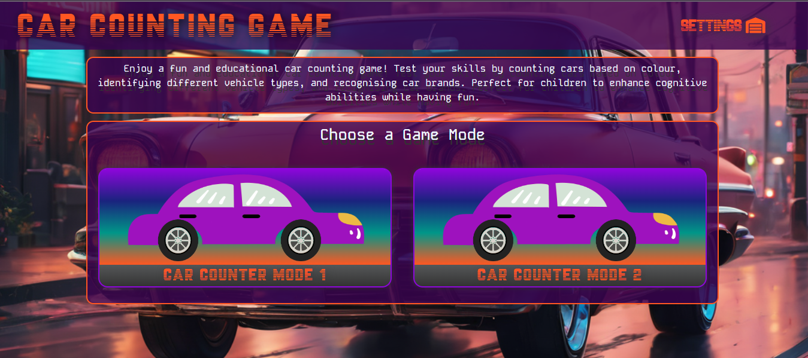

Users will be asked to allow or block geographical location, which is used with Open Weather Map API to check the local weather conditions of the user. 

If the user allows the location to be known, the background will change according to the user’s local weather conditions. There are 15 main conditions listed through Open Weather Map API, each condition will have a different background. 

(Background images used can be found at the Credit section of this documentation) 

If the user denies the location to be used, then a default background will be displayed.

### Open Map Weather API

The project made use of the Open Weather Map API to obtain the player's location and adjust the background image accordingly, depending on the player's local weather conditions. This dynamic feature enriches the user experience by presenting a visually immersive environment that mirrors real-time weather conditions, adding depth and realism to the gaming experience.

[OpenWeatherMap API reference](https://openweathermap.org/current)

Fifteen background images were carefully selected to correspond with various weather conditions, ensuring a comprehensive representation of the player's surroundings. Each image was chosen to complement the main weather description provided by the Open Weather Map API, enhancing the visual authenticity of the game's atmosphere. Furthermore, the images were generated with AI prompts to evoke a retro synthwave aesthetic, further enhancing the game's visual appeal.

Below is 1 of the background drops for Clear Sky:

### Navigation

The navigation has the title of the site, which is clickable, taking the user back to landing page. Settings link opens a modal where user can define site settings.

On the game mode pages, Tutorial is added to the navigation which opens the tutorial for the relevant game mode giving the user rules and step by step instructions on how to play the game mode. 

The navigation is also responsive, so it can be used with ease with tablet devices. 

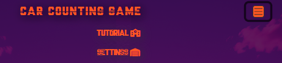

### Settings

Settings is the main feature of the navigation menu. It can be accessed through the landing page and the game mode pages.  

When clicked on settings, it opens a modal. It contains the Music Controls. The user can turn on or off the background music, sound effects and control the volume. The sound settings chosen by the user will be saved to the browsers local storage allowing the users sound settings to be effective across the site. By default, background music and sound effects are turned off, following the good practice principles. 

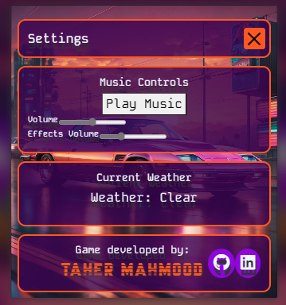

In the settings user can also see the current weather conditions, this changes as their local weather conditions change. For future implementations, this area will give the user to manually enter the city by its name, which will allow the background to change. 

Developer information is also provided here with links to GitHub and LinkedIn profiles. 

### Background Music and Sound Effects 

In the car counting game, players can immerse themselves in an engaging experience with background music and sound effects that enhance the gameplay. The background music sets the tone for excitement and concentration while counting cars on the road. Additionally, the sound effects, such as the revving of engines and honking of horns, add realism to the game environment.  

In game mode 2, players are notified of each level increase by a distinctive sound saying, "Next Level". This auditory cue adds to the immersive experience, providing immediate feedback and recognition of progress. To cater to individual preferences, players have the option to pause the background music and adjust the volume of both the music and sound effects in the settings menu. 

### Game Modes 

#### Game Mode 1 

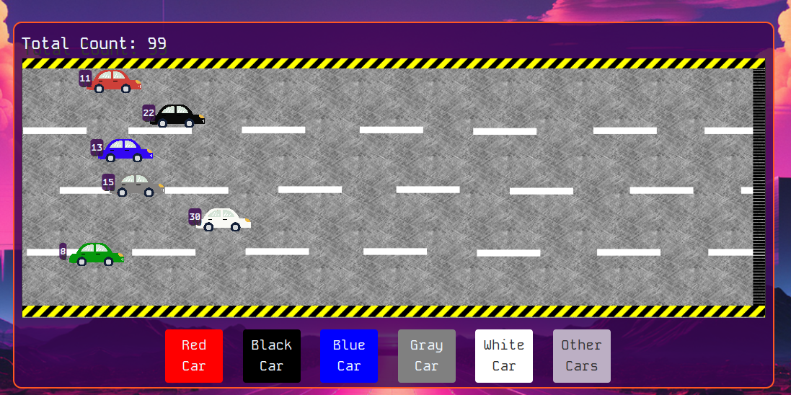

In this game mode, players will need to count the cars that pass on a public road. An advisory state that children will require adult supervision to play this game. Players must maintain a safe distance from the road. Remaining in one position, players will count the number of cars of distinct colours that pass on the public road. The game concludes when the total count reaches 100, and a report card is issued stating how many different cars passed. This information enables players to determine the most and least popular car colours. Additionally, the data can be utilised to enhance mathematical skills through activities such as finding the median number of cars. 

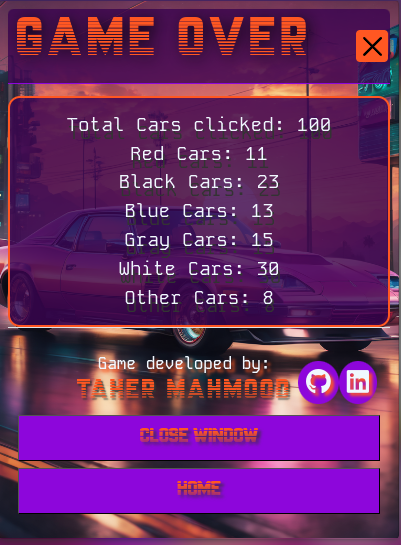
 

#### Game Mode 2 

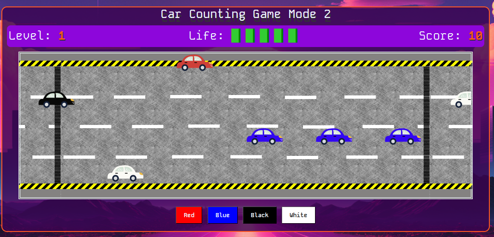

This game mode offers interactivity and can be played on tablets or larger screens. It is optimised for laptops and PCs. In this game mode, cars travel along a track from the left side of the screen to the right side. Players must click on the correct car colour button before it reaches the end of the track. Each correct click earns the player a point, and every 10 cars clicked increase the level and speed of the cars. If the player misses 5 cars, the game ends. The player's score, level, and number of cars clicked are displayed on the end-game report card. 

### Rules - How to play (Tutorial)

Each Game mode has its own rules and step by step tutorial. This can be accessed by clicking the tutorial button on the navigation bar. 

When clicked on Tutorial button a widow will open displaying the game rules, then it will display the settings followed by a guide on how to play the game. The step-by-step guide is provided with instructions and screenshots. 

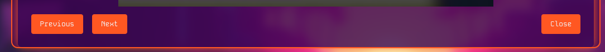

The user can navigate the guide by pressing Next button to go to next step. Previous Button to go to previous step or Close button to close the window as shown below.

### Compatibility 

The game's mechanics involve cars traversing from the left to the right side of the screen, leaving behind a track that is proportionally narrower on smaller display sizes. Due to this design aspect, the game has been optimised to function seamlessly on screens with a minimum width of 600 pixels. Anything less than this threshold would compromise the gameplay experience, as it would not provide sufficient space for the cars to manoeuvre effectively within the game environment. Therefore, to ensure compatibility and an enjoyable gaming experience, the game requires a screen width of at least 600 pixels. 

If the screen width is smaller than 600px, the following message is displayed to the user: 

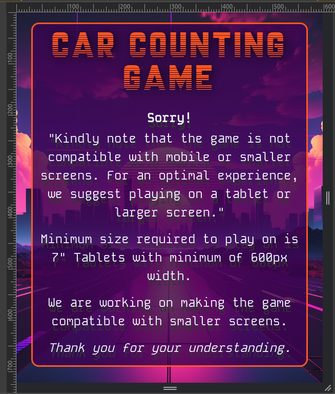

---
---

## Wireframe

### Landing Page Wireframe

### Game Mode 1 Wireframe

### Game Mode 2 Wireframe

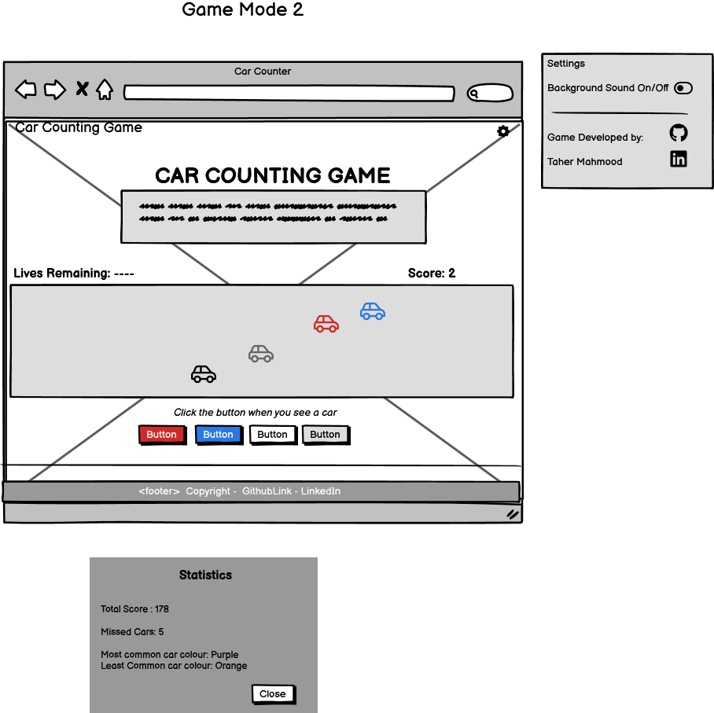

---
---

## Technologies Used

[HTML](https://developer.mozilla.org/en-US/docs/Web/HTML) formed the foundation of the game. 

[Bootstrap 5.3](https://getbootstrap.com/docs/5.3/getting-started/introduction/) was utilised to streamline the design and layout of the game. 

[CSS](https://developer.mozilla.org/en-US/docs/Web/CSS) was utilised to add styles and layout to the game. 

[CSS FlexBox](https://developer.mozilla.org/en-US/docs/Learn/CSS/CSS_layout/Flexbox) facilitated the arrangement of items symmetrically on the pages. 

[CSS :root](https://developer.mozilla.org/en-US/docs/Web/CSS/:root) were used to declare global CSS variables and apply them throughout the project. 

[JavaScript](https://developer.mozilla.org/en-US/docs/Learn/JavaScript/First_steps/What_is_JavaScript) enhanced interactivity on the game. 

[jQuery](https://jquery.com/) complemented JavaScript functionality. 

[JavaScript Obfuscator](https://obfuscator.io/) was employed to obfuscate Open Weather Map API for enhanced security. 

[Visual Studio Code](https://code.visualstudio.com/) served as the primary tool for writing and editing code. 

[Git](https://git-scm.com/) facilitated version control of the game. 

[GitHub](https://github.com/) hosted the game's code. 

[GitHub Projects](https://docs.github.com/en/issues/planning-and-tracking-with-projects/creating-projects/creating-a-project) assisted in project planning. 

[GitHub Pages](https://pages.github.com/) was used to host the game, allowing it to be accessible online. 

[Open Weather Map API](https://openweathermap.org/api) was used to get the users local weather details.

---
---

## Design

### Colour Scheme 

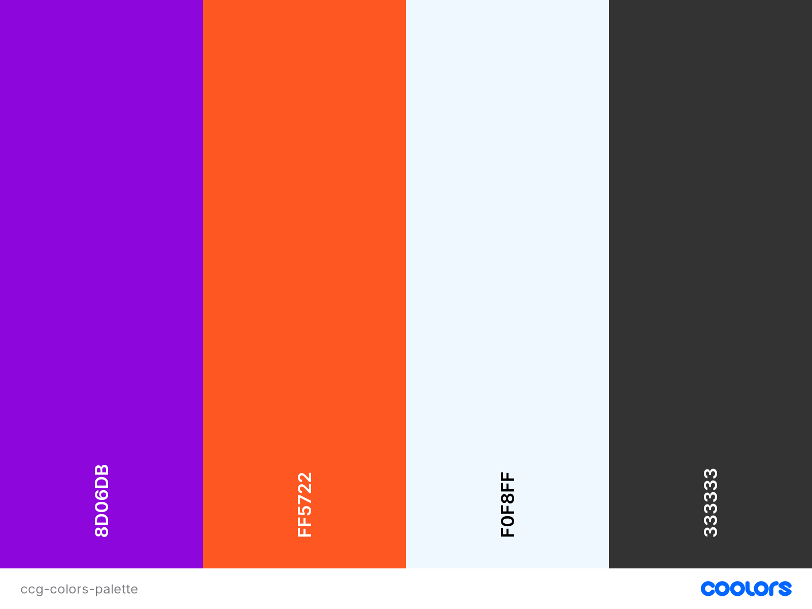

***#8d06db*** was used as main colour. 

***#ff5722*** was used for buttons and border styling. 

***#f0f8ff*** (aliceblue) was used as font colour. 

***#333333*** was used for drop-shadow. 

### Typography

- **Google Fonts** 

***Kode Mono*** was used as main font around the site.  I chose this font as it had that retro look to it which fit the game perfect.
 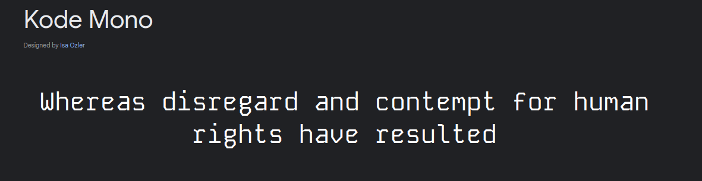

- **DaFont.com** 

***Championship*** was used for Title, play buttons and a few other places where needed. I chose this custom font as it goes with the retro style synthwave background images and it fits the dame perfectly.

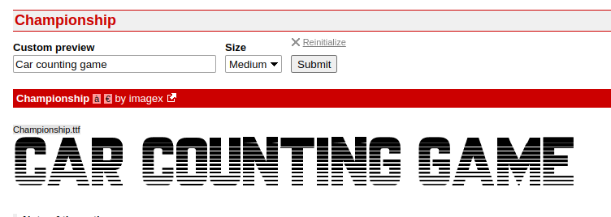

Champions is a true type font (ttf), that was downloaded from dafont.com. I installed the font into the project folder fonts a sub folder of assets, and then used @font-face rule to specify the custom font. 

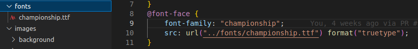

---
---

## Testing and Bugs

Please refer to [TESTING.md](documentation/TESTING.md)

---
---

## Deployment

### Deployment on GitHub: 

If your repository is public, you can use GitHub Pages to host your landing page. 

Go to your repository on GitHub. 

Navigate to the "Settings" tab. 

Scroll down to the "GitHub Pages" section. 

Choose the branch you want to use for GitHub Pages (usually main or master). 

Your landing page will be accessible at https://username.github.io/repository-name 

***This site is deployed here:*** 

https://taherccg.github.io/car-counting-game/index.html 

### Local Deployment 

To make a local copy of this project, you can clone it. In your IDE Terminal, type the following command to clone my repository: 

`git clone https://github.com/TaherCCG/car-counting-game.git` 

---
---

## 404 Page
If user is taken to a page or directory that is not in the project, user is reminded to go back to home page vic clicking on the button.

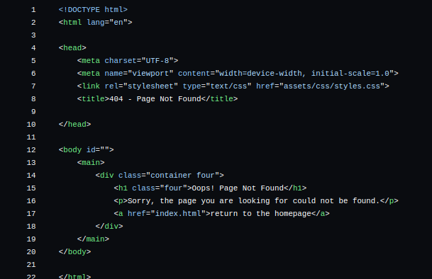

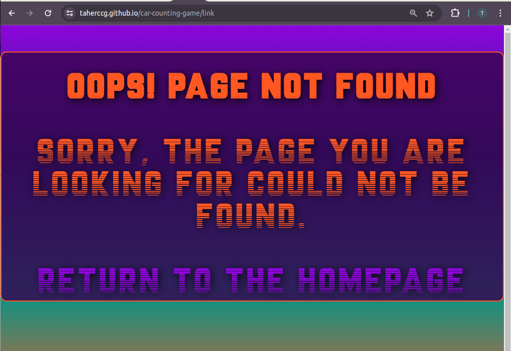

## Future Improvements 

1. Make the game playable on mobile devices. 

2. Optimise performance. 

3. Add input for user to put their location manually. 

4. Build more game modes. 

5. Get user feedback and improve to make user friendly and easy to use. 

6. Add 404 page. 

7. Add User account section, so players can track their own score or count.

---
---

## Credits

### Music

#### Background Music

- "Music by Karl Casey @ White Bat Audio" 
  
[Cyberpunk Synthwave Industrial - Getaway Car // Royalty Free No Copyright Background Music](https://www.youtube.com/watch?v=VIhwbNbMhU8)

#### Sound Effects

Sound effects, used from [Pixabay](https://pixabay.com/)

- [Car Horn](https://pixabay.com/sound-effects/search/car%20horn/?duration=0-30)
- [Car Engine](https://pixabay.com/sound-effects/search/car%20engine%20start/?duration=0-30)
- [Next Level Voice](https://pixabay.com/sound-effects/search/next%20level/?duration=0-30)
- [Game Over](https://pixabay.com/sound-effects/search/game%20over%20voice/?duration=0-30)

### Images 

#### Background 

The following backgrounds were created in [Gencraft AI](https://gencraft.com/generate)

Weather conditions codes/ description was taken from [OpenWeather Map API](https://openweathermap.org/weather-conditions)

| Image # | Weather Condition | Link |
|---|------------------|------------|
|1| Ash |   [background](assets/images/background/ash.webp)|
|2| Clear |   [background](assets/images/background/clear.webp)|
|3| Clouds |   [background](assets/images/background/clouds.webp)|
|4| Drizzle|   [background](assets/images/background/drizzle.webp)|
|5| Dust |   [background](assets/images/background/dust.webp)|
|6| Fog |   [background](assets/images/background/fog.webp)|
|7| Haze |   [background](assets/images/background/haze.webp)|
|8| Mist |   [background](assets/images/background/mist.webp)|
|9| Rain |   [background](assets/images/background/rain.webp)|
|10| Sand |   [background](assets/images/background/sand.webp)|
|11| Smoke |   [background](assets/images/background/smoke.webp)|
|12| Snow |   [background](assets/images/background/snow.webp)|
|13| Squall |   [background](assets/images/background/squall.webp)|
|14| Thunderstorm |   [background](assets/images/background/thunderstorm.webp)|
|15| Tornado |   [background](assets/images/background/tornado.webp)|

- Other images created with Gencraft AI.  These images are used as default background or for modal backgrounds.

| Image # | File used for | Link |
|---|------------------|------------|
|16| Default  |   [background](assets/images/background/default.webp)|
|17| Default 1 |   [background](assets/images/background/default1.webp)|
|18| Modal |   [background](assets/images/background/modal.webp)|
|19| Modal 1|   [background](assets/images/background/modal.webp)|
|20| Modal 2|   [background](assets/images/background/modal.webp)|
|21| Modal 3|   [background](assets/images/background/modal.webp)|
|22| Modal 4|   [background](assets/images/background/modal.webp)|

#### Cars 

I created the cars in [GIMP](https://www.gimp.org/)

| Car # | Color | Link |
|---|------------------|------------|
|1| Black  | [car](assets/images/cars/black_car.png)|
|2| BLue   | [car](assets/images/cars/blue_car.png)|
|3| Gray   | [car](assets/images/cars/gray_car.png)|
|4| Green  | [car](assets/images/cars/green_car.png)|
|5| Orange | [car](assets/images/cars/orange_car.png)|
|6| Red    | [car](assets/images/cars/red_car.png)|
|7| White  | [car](assets/images/cars/white_car.png)|
|8| Yellow | [car](assets/images/cars/yellow_car.png)|
|9| Purple used for animation | [car with no wheels](assets/images/animation-car-no-wheels.png)|
|10| Wheel used for animation  | [wheel](assets/images/wheel.png)|
|11| Track  | [track](assets/images/cars/track.png)|

### Tutorials YouTube 

[Video Tutorial using Open WeatherMap API - Median Man](https://www.youtube.com/watch?v=Mc1w6Q-nxzM) 

### Tools 

- [Birme.net](https://brime.net) used to resize images. 
- [GIMP](https://www.gimp.org/) was employed to create cars and wheels for the game.  Also to resize images for the README, TESTING and DEVELOPMENT files. 
- [Real Favicon Generator](https://realfavicongenerator.net/) was used to generate favicons for the game.
- [Colors.co](https://coolors.co/) was used to create the colour scheme for the game.
- [GenCraft](https://gencraft.com/generate) was used to create stunning background drops for the game.
- [Balsamiq](https://balsamiq.com/) aided in creating wireframes for the game.  
- [Lighthouse](https://developer.chrome.com/docs/lighthouse/overview) was used to check the performance.
- [GoFullPage](https://gofullpage.com/) was used to get full page images.
- [W3C HTML Validator](https://validator.w3.org/) was used to validate HTML documents.
- [Jigsaw W3 CSS Validator](https://jigsaw.w3.org/) was used to validate CSS documents.
- [Peek](https://github.com/phw/peek) was used for animated gif recordings.
- [Responsive Viewer](https://chromewebstore.google.com/detail/responsive-viewer/inmopeiepgfljkpkidclfgbgbmfcennb) was continuously used to test multiple screens while developing.
- [WAVE Web Accessibility Evaluation Tools](https://wave.webaim.org/) was used to check Web Accessibility.

### Research Websites
- [W3C School](https://www.w3schools.com/js/) to read and learn how to use JS.
- [Mozilla Developer](https://developer.mozilla.org/en-US/docs/Learn/JavaScript) Learn JavaScript.
- [Open Weather Map API Guide](https://openweathermap.org/guide) Guide on how to use Open Weather Map API.

---
---

## Acknowledgments

- [Juliia Konovalova](https://github.com/IuliiaKonovalova) Thank you for your awesome guidance throughout this JavaScript project.
- [Code Institute](https://codeinstitute.net) Slack community and members for their help and support.
- [Kevin Powell](https://www.youtube.com/channel/UCJZv4d5rbIKd4QHMPkcABCw) for his CSS tutorials.
- [Online Tutorials](https://www.youtube.com/@OnlineTutorialsYT) for tutorial on CSS Animation.
- [Super Simple Dev](https://youtu.be/SBmSRK3feww?si=oJoi7n9oJxI8Dgya) JavaScript tutorial.

---
---

## Mistakes and personal goals for improvements 

I am aware my commits are not up to standards for good practices. I have tried to use the commits in the style listed below and I am also aware that at times I have made mistakes with my commit messages. 

*I have been using commit types like shown below to improve my commit messages:*

- feat – a new feature is introduced with the changes. 

- fix – a bug fix has occurred.

- chore – changes that do not relate to a fix or feature and do not modify source or test files (for example updating dependencies).

- refactor – refactored code that neither fixes a bug nor adds a feature.

- docs – updates to documentation such as the README or other markdown files. 

- style – changes that do not affect the meaning of the code, related to code formatting such as white-space, missing semi-colons, and so on. 

