# Development

## Introduction
Welcome to the development of the Car Counting Game. This document aims to provide an overview of the project's structure and development process. Though not obligatory for this project, I've found it quite useful to undertake this approach. It assists me in following my own steps, setting tasks, and maintaining to-do lists to facilitate completing the project.

## Project Overview
Crafted with the intention of entertaining and enhancing cognitive abilities, the Car Counting Game (CCG) also serves as a tool to promote mindfulness, especially among young players. Through engaging gameplay and diverse modes, CCG offers a unique opportunity for children to develop attention to detail and critical thinking skills while having fun. By challenging players to count cars based on colours, CCG stimulates cognitive processes and encourages active learning. Additionally, as mindfulness practices positively impact mental health, CCG provides a mindful activity that can alleviate stress and anxiety. With its educational yet entertaining nature, CCG is a valuable tool for parents seeking activities that support cognitive development and positive mental health in their children.

## Getting Started
### Prerequisites
Before setting up the development environment for the Car Counting Game (CCG) in Visual Studio Code, I need to ensure I have the following software, tools, libraries, and dependencies installed:

- **Programming Language:** HTML, CSS, JavaScript
- **Bootstrap:** I used Bootstrap framework for styling and layout.
- **jQuery:** I Ensured the jQuery library is included for DOM manipulation and event handling.
- **Visual Studio Code:** Using Visual Studio Code as the chosen Integrated Development Environment (IDE) for coding and project management.
- **Version Control:** Used Git for version control on Linux operating System.

I ensured that these prerequisites were installed and configured before proceeding with setting up the development environment.

## Installation

I had Git already installed on my Linux Ubuntu OS, I ensured it was linked to my GitHub Account.

### Steps I took to install this project on my local machine synced with GitHub.

1. I first created the directory where i want my project on my local machine using CLI using the following commands.

``` mkdir car-counting-game ```

I then navigated to the folder:

``` cd car-counting-game```

2. I created the repository via the CLI as follows:

``` echo "# Car Counting Game (CCG)" >> README.md```

``` git init ```

``` git add README.md```

``` git commit -m "Initial commit"```

``` git branch -M main```

``` git remote add origin https://github.com/TaherCCG/car-coungint-game.git```

``` git push -u origin main```

3. The repository was created and synced with my local machine.  It can now aso be cloned with the following command: 

```git clone https://github.com/TaherCCG/car-counting-game.git```

4. Branch for development was made.  This is where I will be developing the project.  Additionally I will make more branches when i implement a feature.

``` git checkout -b development```

5. Another branch was made from the main branch for documentation.  This is where all the documentation will be updated.

``` git checkout -b documentation```

6. Stage changes, push and pull.  I mostly used the terminal to stage changed, push and pull.

``` git add <filename>```

``` git commit -m "commit description"```

``` git push```

7.  I used the GitHub online interface to merge branches.  This was done to avoid any issues while merging from CLI.  After the merge was done i used the following command to update the braches.

``` git pull origin main```

The above steps from 4/5 was my repeat workflow to change into the branch I used git checkout without the -b parameter as follows: ``` git checkout < branch name >``` to change into the branch, continue the feature or code I was working on and then move on to step 6 and the to step 7 when needed.

## Github Projects Setup

I set up GitHub Projects for my repository, and I found it incredibly useful for organising my tasks and managing my project's workflow. Here's how I went about it:

### 1. Navigation and Access
I began by navigating to my repository on GitHub and accessing the "Projects" tab.

### 2. Creating a New Project
In the Projects tab, I clicked on the "New project" button to create a new project board.

### 3. Choosing a Template 
GitHub offered several templates to help me get started, but I decided to create a custom project board from scratch.

### 4. Configuration
I named my project board and provided a description that reflected the goals and purpose of my project.

### 5. Adding Columns
To customise my project board, I added columns that represented different stages of my project workflow, such as "Backlog", "Ready", "In Progress", "In Review", "Documentation" and "Done".

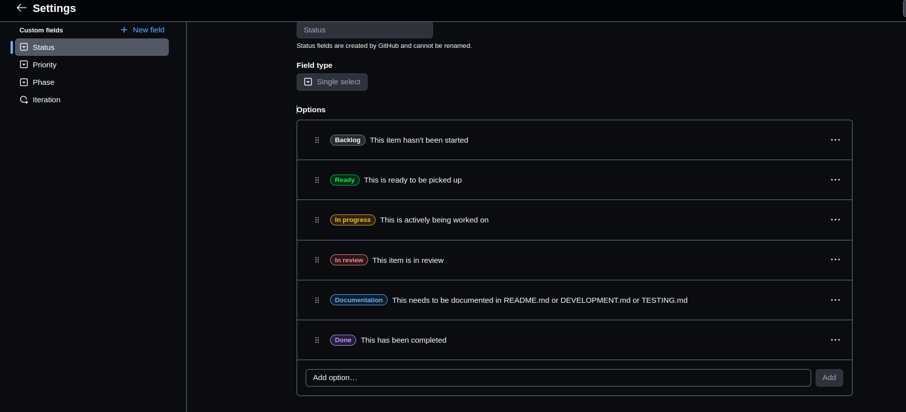

### 6. Adding Phases
I added columns that represented different phases of my project workflow, such as "Initiation", "Planning", "Design", "Development", "Testing", "Deployment" and "Documentation".  I also used short description as shown below in the image:

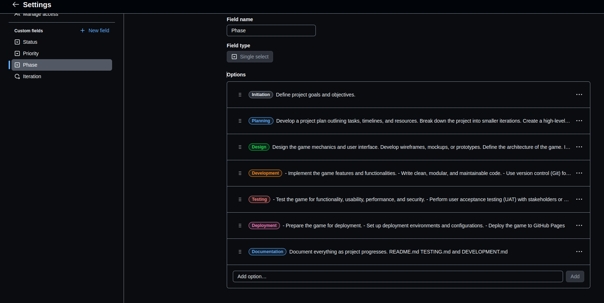

### 7. Task Priority Label
I used Priority labels for any issues / tasks that I needed to complete, The priority labels made it useful form me to organise the most or least important tasks. I used them such as "P1-Critical", "P2-High", "P3-Medium", "P4-Backlog", "P5-Enhancement", "P6-Invalid" and "P7-Needs Triage".  I also gave short description for my own reference.

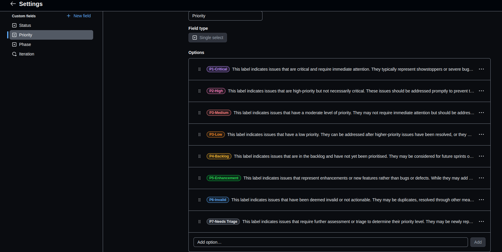

### 8. Iteration planning
I planned my project into iterations with the amount of days it needs to be completed and start / end date for each iteration. I organised my iterations as "Iteration 1 (planning + project set up)", "Iteration 2 (develop structure)", "Iteration 3 (add JS and Styling)", "Iteration 4 (testing)", "Iteration 5 (final tune-up of documentation)", "Iteration 6 (hand-in ready)" and "Iteration 7 (feedback fixes)".  I found setting up my project like this was very useful as i had given my self the dead lines to meet before moving to the next iteration.

Iteration 1  completed

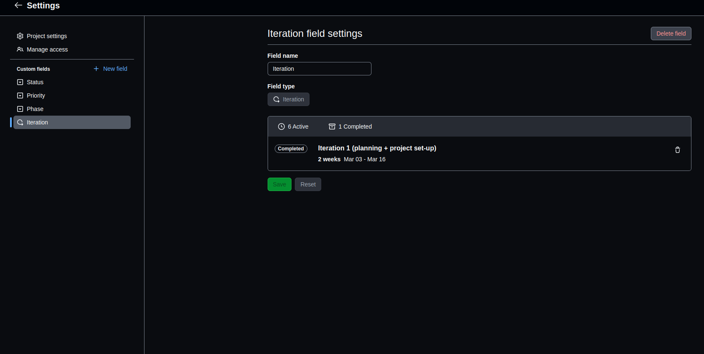

Iteration with description that are not completed at the time of screenshot.

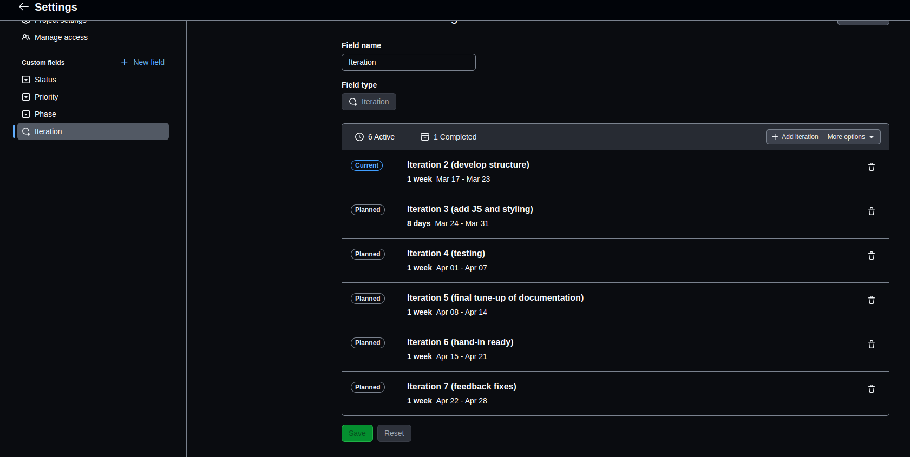

### 9. Adding Cards
I populated my project board with cards to represent individual tasks, issues, and features. Each card had a title and additional information to provide context.

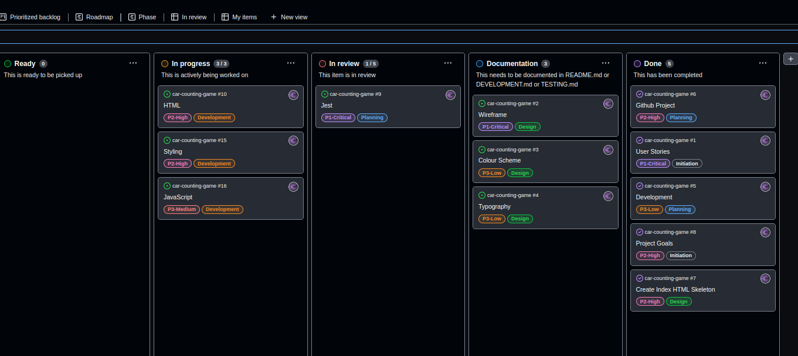

### 10. Managing Cards
I could easily move cards between columns to track their progress through my workflow. I assigned cards to myself, added due dates, and used labels to categorise them.

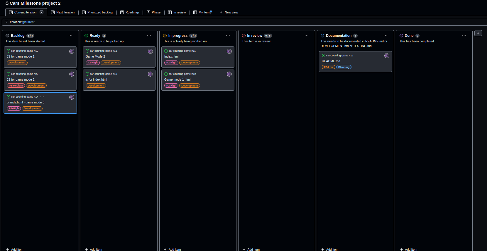

### 11. Monitoring and Updates
Regularly reviewing and updating my project board enabled me to monitor progress and identify any issues or bottlenecks. The project board became a central hub for my project management.

**Iteration 2 being worked on**
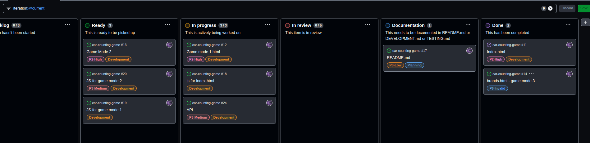

**Issues**

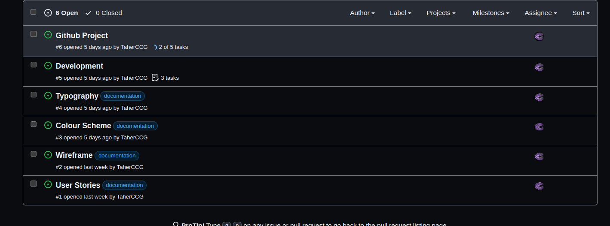

**Iteration board based on priority**

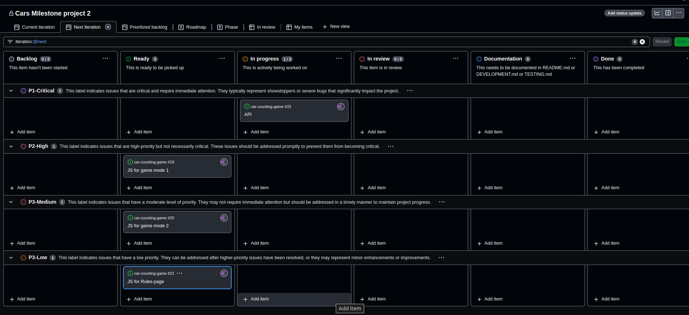

**Scrolling through Priority board**

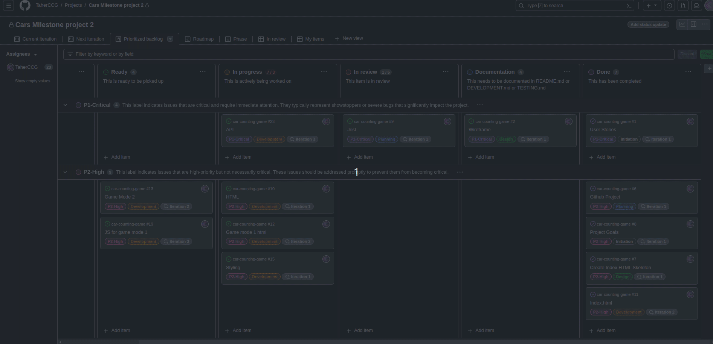

**Project Roadmap**

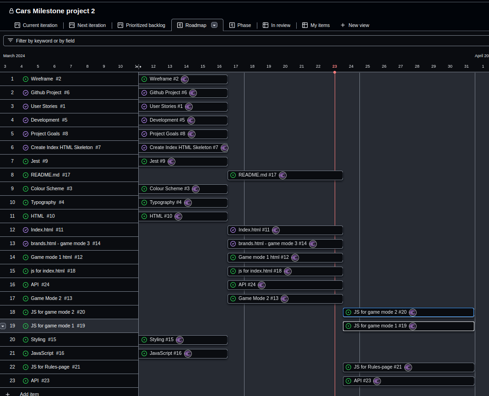

Overall, setting up GitHub Projects was a game-changer for me. It provided a visual representation of my project's workflow, helping me stay organised and focused. With GitHub Projects, I could easily track tasks, and keep my project on track. It's now an essential tool in my development process.


## Acknowledgements
Participating in Hackathons has heightened my awareness of the significance of utilising GitHub Projects and the crucial role of a Scrum Master, despite not having assumed that role yet. Nevertheless, I have gleaned a wealth of knowledge simply by observing how my Hackathon teams employed the GitHub Projects board. Learning from their practices has been a valuable experience, enabling me to incorporate those lessons into my own projects.

I understand that my project board might not be perfect, but I've put in my best effort to set it up. I did encounter some mistakes along the way, but I'm committed to rectifying them for my next project. The more I use the project board, the more I'll learn.

Thank you for taking the time to view this document, even though it wasn't necessary for this project.