# TESTING

**Automated Testing:**

- *Efficiency:* Automated testing uses software tools to run pre-scripted tests, allowing for repeated tests without human intervention.
- *Consistency:* Ensures consistent testing procedures and results, reducing human error.
- *Speed:* Faster than manual testing, especially for complex systems.

**Manual Testing:*

- *Exploratory Testing:* Allows testers to uncover unexpected issues in an unscripted manner.
- *User Experience Evaluation:* Essential for evaluating usability and interface design.
Edge Cases and Usability: Identifies edge cases and assesses usability from a human perspective.

**When to Deploy Each:**

- *Automated Testing:* Best for repetitive tasks and stable areas of the application.
- *Manual Testing:* Deploy for new features, usability testing, and scenarios difficult to automate.

## Browser Compatibility Tests

- I tested the website in different browsers for compatibility.
<ul>
<li>Chrome</li>

<li> Firefox </li>

<li>Brave</li>

<li>Opera</li>

</ul>

---
---

## Responsive

---
---

## Manual Testing

| feature                                                         | action                                                 | expected result                                                  | tested | passed | comments |
| --------------------------------------------------------------- | ------------------------------------------------------ | ---------------------------------------------------------------- | ------ | ------ | -------- |
| **Weather API**                                                 |                                                        |                                                                  |        |        |          |
| Permission to use location                                      | Allowed                                                | Background is set to users current weather conditions            | Yes    | Yes    | -        |
| Permission to use location                                      | Denied                                                 | Background is set to default                                     | Yes    | Yes    | -        |
| **Navbar**                                                      |                                                        |                                                                  |        |        |          |
| Logo                                                            | Click on the "Logo" link                               | The user is redirected to the main page                          | Yes    | Yes    | -        |
| Settings                                                        | Click on the "Setting" link                            | The settings modal opens                                         | Yes    | Yes    | -        |
| Tutorial                                                        | Click on the "Tutorial" link                           | The tutorial step-by-step window guid opens                      | Yes    | Yes    | -        |
| **Settings Modal**                                              |                                                        |                                                                  |        |        |          |
| Un-mute Music & sound effects                                   | Click on the Play button                               | Music & sound effects are un-muted                               | Yes    | Yes    | -        |
| Mute Music & sound effects                                      | Click on the Pause button                              | Music & sound effects are muted                                  | Yes    | Yes    | -        |
| Background Music volume controls                                | Adjust background volume bar                           | Background Music can be adjusted                                 | Yes    | Yes    | -        |
| Sound Effects volume controls                                   | Adjust sound effects volume bar                        | Sound Effects can be adjusted                                    | Yes    | Yes    | -        |
| GitHub icon in the modal footer                                 | Click on the GitHub icon                               | The user is redirected to the GitHub profile page                | Yes    | Yes    | -        |
| LinkedIn icon in the modal footer                               | Click on the LinkedIn icon                             | The user is redirected to the LinkedIn profile page              | Yes    | Yes    | -        |
| Modal can be closed by press the modal close button (x)         | Click on the X icon                                    | The modal closes                                                 | Yes    | Yes    | -        |
| Modal can be closed by pressing outside modal                   | Click outside the modal                                | The modal closes                                                 | Yes    | Yes    | -        |
| **Game Modes on Landing Page**                                  |                                                        |                                                                  |        |        |          |
| *Game Mode 1*                                                   |                                                        |                                                                  |        |        |          |
| Background music is not played                                  | Background music setting are disabled in settings menu | Background music is not played                                   | Yes    | Yes    | -        |
| Background music is played                                      | Background settings are enabled in settings menu       | Background music is played                                       | Yes    | Yes    | -        |
| Game mode 1 card animation                                      | Hover over Game mode 1 card                            | Card animation is played                                         | Yes    | Yes    | -        |
| Game mode 1 description                                         | Hover over Game mode 1 card                            | Game mode 1 description is displayed                             | Yes    | Yes    | -        |
| Game mode 1 Play button                                         | Hover over Game mode1 card                             | Game mode 1 Play button is displayed                             | Yes    | Yes    | -        |
| Game mode 1 Play button hover effects                           | Hover over Game mode 1 card button                     | Game mode 1 Play button effects are displayed                    | Yes    | Yes    | -        |
| Game mode 1 Sound effect is muted                               | Hover over Game mode 1 card                            | By default sound is muted                                        | Yes    | Yes    | -        |
| Game mode 1 Sound effect is played                              | Hover over Game mode 1 card                            | Sound is played if user has played the sound effects in settings | Yes    | Yes    | -        |
| Game mode 1 Play button                                         | Hover over Game mode 1 card                            | Game mode 1 Play button is displayed                             | Yes    | Yes    | -        |
| Game mode 1 Play button Sound effect is muted                   | Click play button for game mode 1                      | By default sound is muted                                        | Yes    | Yes    | -        |
| Game mode 1 Play button Sound effect is played                  | Click play button for game mode 1                      | Sound is played if user has played the sound effects in settings | Yes    | Yes    | -        |
| Launch Game mode 1                                              | Click Game mode 1 Play button                          | The user is redirected to Game mode 1 page                       | Yes    | Yes    | -        |
| *Game Mode 1*                                                   |                                                        |                                                                  |        |        |          |
| Game mode 2 card animation                                      | Hover over Game mode 2 card                            | Card animation is played                                         | Yes    | Yes    | -        |
| Game mode 2 description                                         | Hover over Game mode 2 card                            | Game mode 2 description is displayed                             | Yes    | Yes    | -        |
| Game mode 2 Play button                                         | Hover over Game mode1 card                             | Game mode 2 Play button is displayed                             | Yes    | Yes    | -        |
| Game mode 2 Play button hover effects                           | Hover over Game mode 2 card button                     | Game mode 2 Play button effects are displayed                    | Yes    | Yes    | -        |
| Game mode 2 Sound effect is muted                               | Hover over Game mode 2 card                            | By default sound is muted                                        | Yes    | Yes    | -        |
| Game mode 2 Sound effect is played                              | Hover over Game mode 2 card                            | Sound is played if user has played the sound effects in settings | Yes    | Yes    | -        |
| Game mode 2 Play button                                         | Hover over Game mode 2 card                            | Game mode 2 Play button is displayed                             | Yes    | Yes    | -        |
| Game mode 2 Play button Sound effect is muted                   | Click play button for game mode 2                      | By default sound is muted                                        | Yes    | Yes    | -        |
| Game mode 2 Play button Sound effect is played                  | Click play button for game mode 2                      | Sound is played if user has played the sound effects in settings | Yes    | Yes    | -        |
| Launch Game mode 2                                              | Click Game mode 2 Play button                          | The user is redirected to Game mode 2 page                       | Yes    | Yes    | -        |
| **Game Mode 1 page**                                            |                                                        |                                                                  |        |        |          |
| Background music is not played                                  | Background music setting are disabled in settings menu | Background music is not played                                   | Yes    | Yes    | -        |
| Background music is played                                      | Background settings are enabled in settings menu       | Background music is played                                       | Yes    | Yes    | -        |
| *Game Mode 1 Tutorial*                                          |                                                        |                                                                  |        |        |          |
| Game mode 1 tutorial                                            | Click on tutorial link in navigation                   | Tutorial window opens                                            | Yes    | Yes    | -        |
| Game mode 1 tutorial Next button                                | Go to Next step                                        | Takes the user to next step                                      | Yes    | Yes    | -        |
| Game mode 1 tutorial Previous Button                            | Go to previous step                                    | Takes the user to previous step                                  | Yes    | Yes    | -        |
| Game mode 1 tutorial Close Button                               | Close tutorial window                                  | The user is redirected to Game mode 1 page                       | Yes    | Yes    | -        |
| *Game Mode 1 Game Controls*                                     |                                                        |                                                                  |        |        |          |
| Game mode 1 Start Button                                        | Click the start button                                 | Starts the game                                                  | Yes    | Yes    | -        |
| Game mode 1 Red Button                                          | Click Red Button                                       | Moves the red car on track by 10px and updates count             | Yes    | Yes    | -        |
| Game mode 1 Blue Button                                         | Click Red Button                                       | Moves the blue car on track by 10px and updates count            | Yes    | Yes    | -        |
| Game mode 1 Black Button                                        | Click Red Button                                       | Moves the black car on track by 10px and updates count           | Yes    | Yes    | -        |
| Game mode 1 White Button                                        | Click Red Button                                       | Moves the white car on track by 10px and updates count           | Yes    | Yes    | -        |
| Game mode 1 Gray Button                                         | Click Red Button                                       | Moves the gray car on track by 10px and updates count            | Yes    | Yes    | -        |
| Game mode 1 Other Button                                        | Click Red Button                                       | Moves the other car on track by 10px and updates count           | Yes    | Yes    | -        |
| Game mode 1 sound effect is played when buttons are clicked     | Click Button plays sound if it is on                   | Plays sound                                                      | Yes    | Yes    | -        |
| Game mode 1 sound effect is not played when buttons are clicked | Click Button does not plays sound if sound is off      | Does not play sounds                                             | Yes    | Yes    | -        |
| *Game Mode 1 Game End Card*                                     |                                                        |                                                                  |        |        |          |
| Game mode 1 End card                                            | End game card is displayed when count totals to 100    | Displays end game card                                           | Yes    | Yes    | -        |
| Game mode 1 End card close button                               | Click close Button                                     | Closes the end game card                                         | Yes    | Yes    | -        |
| Game mode 1 End card home button                                | Click Home button                                      | Redirects user to Home page                                      | Yes    | Yes    | -        |
| **Game Mode 2 page**                                            |                                                        |                                                                  |        |        |          |
| Background music is not played                                  | Background music setting are disabled in settings menu | Background music is not played                                   | Yes    | Yes    | -        |
| Background music is played                                      | Background settings are enabled in settings menu       | Background music is played                                       | Yes    | Yes    | -        |
| *Game Mode 2 Tutorial*                                          |                                                        |                                                                  |        |        |          |
| Game mode 2 tutorial                                            | Click on tutorial link in navigation                   | Tutorial window opens                                            | Yes    | Yes    | -        |
| Game mode 2 tutorial Next button                                | Go to Next step                                        | Takes the user to next step                                      | Yes    | Yes    | -        |
| Game mode 2 tutorial Previous Button                            | Go to previous step                                    | Takes the user to previous step                                  | Yes    | Yes    | -        |
| Game mode 2 tutorial Close Button                               | Close tutorial window                                  | The user is redirected to Game mode 1 page                       | Yes    | Yes    | -        |
| *Game Mode 2 Game Controls*                                     |                                                        |                                                                  |        |        |          |
| Game mode 2 Start Button                                        | Click the start button                                 | Starts the game                                                  | Yes    | Yes    | -        |
| Game mode 2 Red Button                                          | Click Red Button                                       | Removes the red car on track and updates score                   | Yes    | Yes    | -        |
| Game mode 2 Blue Button                                         | Click Red Button                                       | Removes the blue car on track and updates score                  | Yes    | Yes    | -        |
| Game mode 2 Black Button                                        | Click Red Button                                       | Removes the black car on track and updates score                 | Yes    | Yes    | -        |
| Game mode 2 White Button                                        | Click Red Button                                       | Removes the white car on track and updates score                 | Yes    | Yes    | -        |
| Game mode 2 Level Up                                            | Every 10 clicks gets you on higher level               | Level increases the speed of car                                 | Yes    | Yes    | -        |
| Game mode 2 Play Level Up Sound effects                         | Every 10 clicks gets you on higher level               | sound effect is played if user enabled it                        | Yes    | Yes    | -        |
| Game mode 2 Dose Not Play Level Up Sound effects                | Every 10 clicks gets you on higher level               | sound effect is not played if user disabled it                   | Yes    | Yes    | -        |
| Game mode 2 Life Lost                                           | 1 Life is lost if user does not click the car on track | 1 Life block is taken away from life bar                         | Yes    | Yes    | -        |
| Game mode 2 Game Over                                           | If user does not click the car on track 5 times        | Game Ends                                                        | Yes    | Yes    | -        |
| *Game Mode 2 Game End Card*                                     |                                                        |                                                                  |        |        |          |
| Game mode 2 Game End card                                       | Game End card is displayed when user misses 5 cars     | Displays end game card                                           | Yes    | Yes    | -        |
| Game mode 2 Game Over Sound effects                             | When game ends sound effect is played                  | sound effect is played if user enabled it                        | Yes    | Yes    | -        |
| Game mode 2 Dose Not Play Game Over Sound effects               | When game end Game Over sound is not played            | sound effect is not played if user disabled it                   | Yes    | Yes    | -        |
| Game mode 2 Game End card close button                          | Click close Button                                     | Closes the end game card                                         | Yes    | Yes    | -        |
| Game mode 2 Game End card home button                           | Click Home button                                      | Redirects user to Home page                                      | Yes    | Yes    | -        |

---
---

## Validation Testing

### HTML 
 Using W3C HTML validator to test each page.

- **Home Page**

- **Game mode 1**
- 
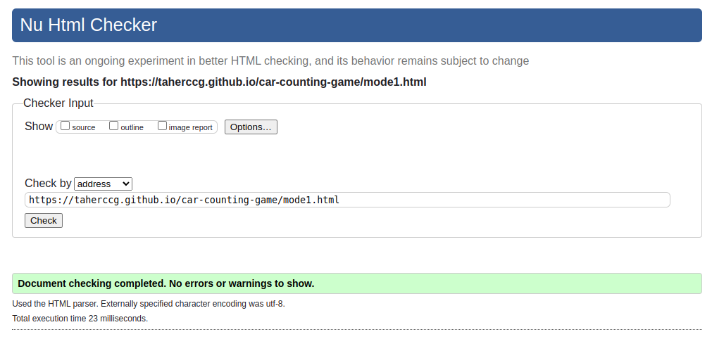

- **Game mode 2**
  

### CSS 
Using W3C CSS Jigsaw validator to test CSS.

- **styles.css**
  

- **mode1.css**

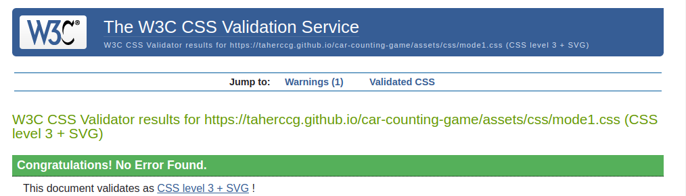

- **mode2.css**

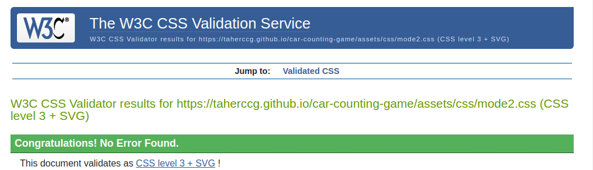

## JShint 

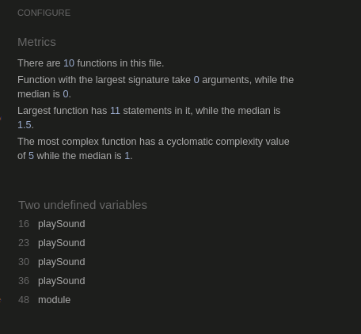

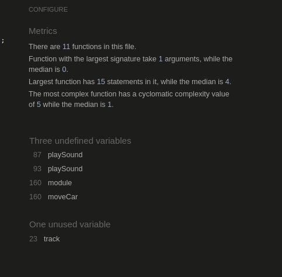

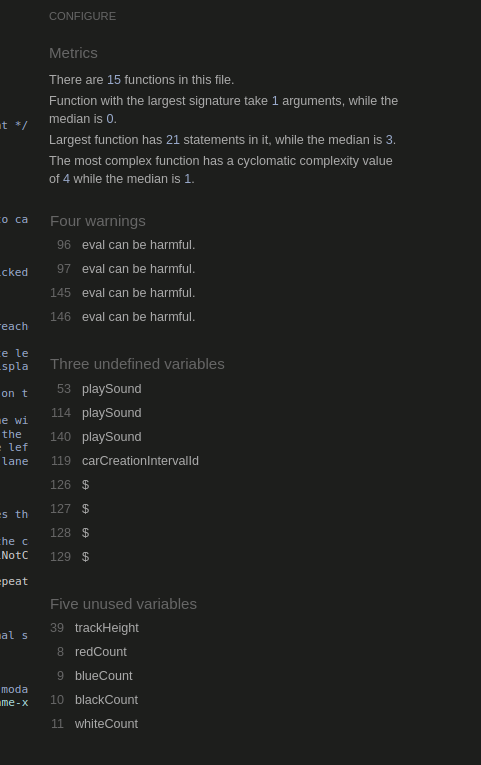

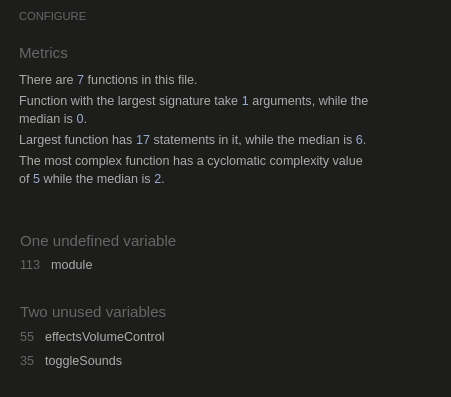

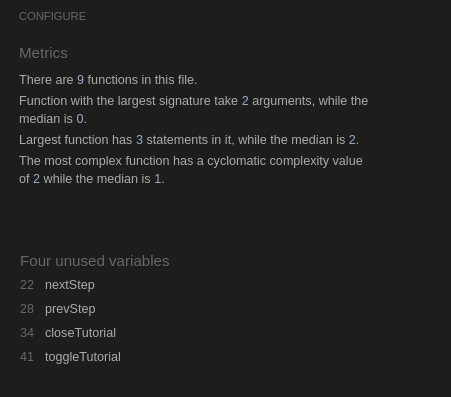

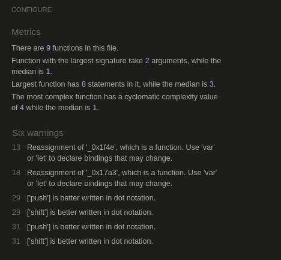

---
---

## jest Test

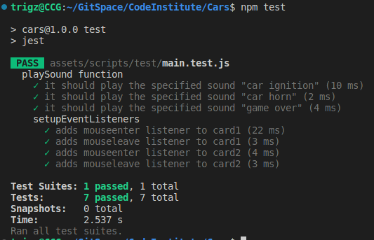

---
---

## LightHouse
Using Lighthouse to check performance.

- **Home Page**

- **Game mode 1**
 
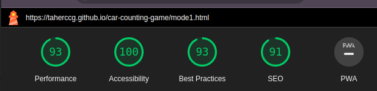

- **Game mode 2**

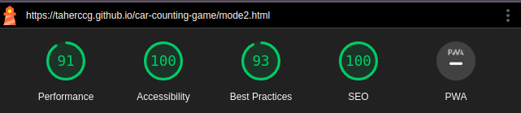

---
---

## WAVE Web Accessibility Evaluation Tool

- **Home Page**

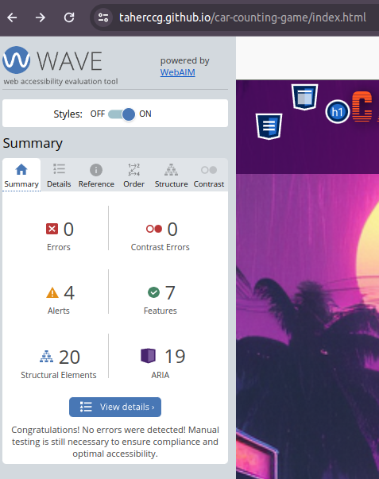

- **Game mode 1**
 
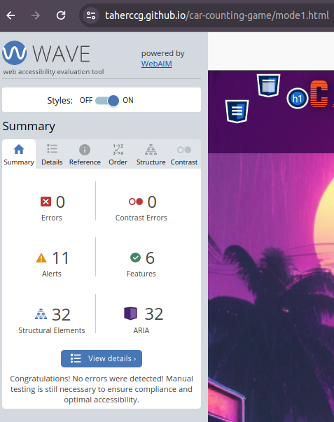

- **Game mode 2**

---
---

## Bugs

### Solved Bugs

- The sound effects music was not being saved, the way the background music is saved to users local storage across the site.

`effectsVolumeControl.addEventListener('input', function () {
        sounds.effectsVolume = effectsVolumeControl.value;
    });`

  - Solution:
  Redone the function to include local storage on toggle.

    `function toggleSounds(isPlaying) {`
        `for (const key in sounds) {`
            `if (Object.hasOwnProperty.call(sounds, key)) {`
                `const sound = sounds[key];`
                `if (isPlaying) {`
                    `sound.muted = false;`
                `} else {`
                    `sound.muted = true;`
                `}`
            `}`
        `}`
        `localStorage.setItem('isSoundOn', isPlaying ? 'true' : 'false');`
    
    `function soundSettings() {`
        `const isSoundOn = localStorage.getItem('isSoundOn');`
        `if (isSoundOn === 'true') {`
            `toggleSounds(true);`
        `} else {`
            `toggleSounds(false);`
        `}`
    `}`
    `soundSettings();` 
  

### Unsolved bugs

- Cars go pass the track in game mode 1 on smaller screens due to car movement by 10px

- **Possible Solution:**
  
  - Assign different variables with pre-defined px
  - Assign a Variable to get window.innerWidth
  - Declare a function that checks the width of screen
  - Assign the pre-defined variable according to screen size 
  - Assign it to the defined px variable

This will be implemented as soon as possible if it works otherwise I will look for another solution. 

